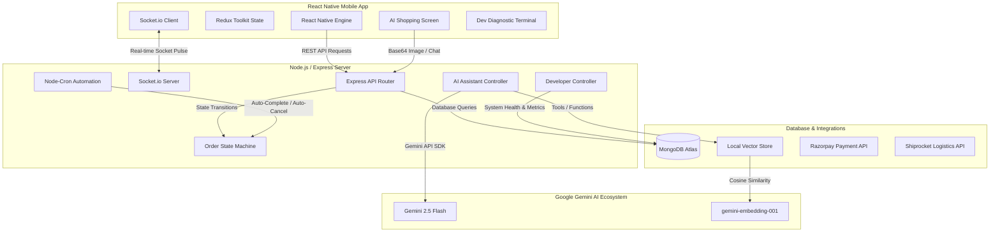

# 🎓 The Ultimate Interview Presentation Guide: New Raj Fancy Store
*Product Architect & Lead Engineer Interview Masterclass*

This document is your complete playbook for presenting the **New Raj Fancy Store** platform in your software engineering interview. It bridges the gap between high-level product design and deep technical implementation.

---

## 🗺️ Project Architecture at a Glance

---

## 🗣️ Chapter 1: The "Describe Your Project" Elevator Pitch (1-2 Mins)

When an interviewer asks: **"Can you tell me about the most complex project you've worked on recently?"**, deliver this response:

> "I architected and built **New Raj Fancy Store**, a double-sided social e-commerce platform specifically designed for independent clothing resellers in India. 
> 
> What makes this project technically challenging is that it’s not just a standard store; it has a **multi-tier reseller financial engine** where users can share products on social media (like WhatsApp) with custom profit margins (5% to 30%). The backend manages these transactions, holds pending balances in a secure digital wallet, and releases them only after a verified 7-day return window. 
> 
> To make it modern and highly engaging, I integrated a **Visual AI Shopping Assistant** powered by Gemini 2.5 Flash that uses Multimodal Vision (like Google Lens), Agentic Function Calling, Vector Database semantic search, and Localized RAG for store policy retrieval. 
> 
> Additionally, I built an interactive **Developer Diagnostic Terminal** directly inside the mobile app that uses WebSockets to monitor server performance, track live order transactions, analyze financials, and trigger administrative safeguards in real-time."

---

## 🔍 Chapter 2: The Core Pillars (Breakdown for Deep Dives)

### 🧱 Pillar 1: The Reseller Financial Engine & Wallet Flow
*   **The Problem:** Traditional e-commerce platforms do not support reseller margins. Calculating margins, handling cancellations, processing partial returns, and crediting digital wallets without double-credits or money leaks is highly complex.
*   **How it Works:** 
    1. A reseller generates a referral link with an embedded margin percentage.
    2. A customer purchases the item via the link.
    3. The server intercepts the order, calculates the cost price, selling price, and reseller commission, and records `resellerEarning` with status `pending`.
    4. The earnings are reflected in the reseller's wallet under `pendingBalance` (preventing premature withdrawals).
    5. A scheduled hourly job (`cronJobs.js`) checks if the order return window (7 days) has expired. If so, it invokes the `OrderStateMachine` to advance the order to `completed` and credits the wallet balance, shifting the money from `pendingBalance` to `balance` (available for withdrawal).
*   **The Code Connection:** [OrderStateMachine.js](file:///c:/rnapp/Server_ERA/utils/OrderStateMachine.js) and [resellerController.js](file:///c:/rnapp/Server_ERA/controllers/resellerController.js).

### 🤖 Pillar 2: Agentic Visual Shopping Assistant (Vision + Tools + RAG + Embeddings)
*   **The Problem:** Standard search engines rely on exact keyword matches and cannot process visual descriptions or images, leading to a poor customer discovery experience.
*   **How it Works:**
    1. **Visual Search (Google Lens-style):** A user uploads an image of a dress. The app converts it to a base64 string and posts it to `/api/ai-assistant/chat`.
    2. **Multimodal Interpretation:** The backend sends the image to `gemini-2.5-flash`. The model identifies the visual style (e.g., "green georgette saree with gold embroidery").
    3. **Agentic Function Calling:** Using the `@google/genai` SDK, the LLM determines it needs to find matching items, so it automatically invokes the `search_catalog` tool with the text description.
    4. **Vector Database Semantic Search:** The backend receives the tool request, generates a 768-dimensional text embedding of the query using `gemini-embedding-001`, and compares it against pre-computed embeddings of the product catalog using a Cosine Similarity algorithm, returning the top matches.
    5. **Localized RAG Pipeline:** If the user asks a question about policies (e.g., "Can I return a custom-stitched item?"), the LLM invokes the `get_store_policy` tool, which reads the local `ai_store_policy.txt` text, injects it into the prompt context, and responds naturally.
*   **The Code Connection:** [aiAssistantController.js](file:///c:/rnapp/Server_ERA/controllers/aiAssistantController.js), [aiVectorService.js](file:///c:/rnapp/Server_ERA/services/aiVectorService.js), and [aiRagService.js](file:///c:/rnapp/Server_ERA/services/aiRagService.js).

### 🖥️ Pillar 3: Interactive Developer Diagnostic Terminal
*   **The Problem:** Developers and admins need a way to inspect backend logs, server health metrics, user databases, and transaction statistics on the fly without having SSH access or logging into databases like MongoDB Compass while on the move.
*   **How it Works:**
    1. **Role-Based Access Control (RBAC):** Users with the role `developer` are instantly redirected at login to the Developer Navigator rather than the retail store.
    2. **System Diagnostics:** Hits custom routes on `developerController.js` to read CPU usage, memory allocations, Mongoose connection pool states, and system uptime.
    3. **Live Order Pulse (WebSockets):** Utilizes `socket.io` to establish a persistent full-duplex channel. When orders are created or updated, the server broadcasts events directly to the developer's phone screen.
    4. **Remote Operations:** Enables developers to suspend malicious users, reset passwords, toggle maintenance mode, and view live Express server error queues in real-time.
*   **The Code Connection:** [DeveloperNavigator.js](file:///c:/rnapp/mobile/src/navigation/DeveloperNavigator.js), [developerController.js](file:///c:/rnapp/Server_ERA/controllers/developerController.js), and [DevHubScreen.js](file:///c:/rnapp/mobile/src/screens/dev/DevHubScreen.js).

---

## 🛡️ Chapter 3: Security & Engineering Safeguards (How You Stand Out)

Senior engineers stand out by showing **how they prevent failures**. Be ready to talk about these 4 real security and reliability mechanisms in your code:

| Scenario / Attack | Risk | Code Safeguard | Implementation Detail |
| :--- | :--- | :--- | :--- |
| **Bypassing Delivery Stages** | Reseller forces an order to `completed` via API to withdraw commission early. | **State Machine Transition Guard** | [OrderStateMachine.js](file:///c:/rnapp/Server_ERA/utils/OrderStateMachine.js) defines a strict adjacency list of valid state transitions. Transitioning directly from `pending` to `completed` throws a validation error. |
| **Double Refund Attack** | Malicious user double-clicks the refund button, triggering concurrent database queries to refund money twice. | **MongoDB Transaction Check** | Status verification checks `orderStatus === 'refunded'` inside an atomic update. If the order is already refunded, subsequent transactions abort immediately. |
| **Negative Pricing Attack** | Attacker intercepts API call and updates checkout price below wholesale cost. | **Price Sanitization** | Order creation controller checks item pricing details against the master `Product` model in the database, recalculating and validating totals on the server. |
| **Memory / Connection Leaks** | Active database connections hang, consuming RAM until the server crashes. | **Lifecycle Hooks & Cleanup** | Configured automated testing scripts with strict cleanup processes: `afterAll(async () => await mongoose.connection.close())` to terminate active pools. |

---

## ❓ Chapter 4: Core Q&A (Prepare for the Toughest Questions)

### Q1: Describe your project.
> **Answer:** "New Raj Fancy Store is an e-commerce platform built with React Native and Node.js. It features a custom reseller wallet engine that lets users share products with embedded profit margins, combined with a Gemini-powered visual shopping assistant (multimodal vision search, vector database semantic matching, and local RAG) and an embedded developer terminal for real-time monitoring and administrative override."

### Q2: Why did you choose Gemini 2.5 Flash for the AI Assistant?
> **Answer:** "Gemini 2.5 Flash offers the perfect combination of speed (very low latency for a conversational chatbot), native multimodality (can directly accept the base64 image representation from the React Native camera/gallery without needing external OCR pipelines), and built-in function calling support. It is highly cost-effective and responsive."

### Q3: Your vector database search is mock/in-memory. How would you scale this in production?
> **Answer:** "For the prototype, I implemented an in-memory vector store that fetches products, embeds them using `gemini-embedding-001` via the SDK, and runs a Cosine Similarity calculation in JavaScript. To scale this to tens of thousands of products, I would migrate to **MongoDB Atlas Vector Search** or a dedicated service like **Pinecone**. I would write a database trigger that automatically updates the vector index whenever a product is added or modified, and replace the JavaScript Cosine Similarity function with a native MongoDB `$vectorSearch` pipeline query."

### Q4: How do WebSockets work in the Developer Diagnostic Terminal?
> **Answer:** "The terminal uses `socket.io` for bi-directional communication. When a developer logs in, the app initiates a persistent connection. The backend intercepts database events (like a new order or a transaction) and broadcasts them using `io.emit('order_created')`. The mobile client listens for these events and updates the Redux store or local state array, animating the new data instantly onto the screen without polling."

### Q5: What is the difference between RAG and Vector DB Search in your AI Assistant?
> **Answer:** 
> * **Vector Search:** Converts the user's description (e.g. 'silk sarees') into numerical embeddings to scan the catalog database for matches. It does not generate text; it returns database items.
> * **RAG (Retrieval-Augmented Generation):** Used for question answering. When the user asks about returns, the agent fetches the entire text file (`ai_store_policy.txt`) containing the rules and provides it as raw context to Gemini. Gemini reads this context and synthesizes a natural response, ensuring it doesn't hallucinate rules."

### Q6: How does the app determine user roles, and how is it secure?
> **Answer:** "We use JSON Web Tokens (JWT) for authentication. When a user logs in, the server returns a signed JWT containing their user ID and role (e.g., `customer`, `reseller`, `admin`, `developer`). On the mobile client, Redux handles the authentication state. The navigation engine (`AppNavigator.js`) reads the Redux state: if `user.role === 'developer'`, it mounts the `DeveloperNavigator` Stack; otherwise, it mounts the standard store interface. On the backend, routes like `/api/developer/*` are protected by a middleware that decodes the JWT and rejects any requests where `req.user.role !== 'developer'`."

---

## 🏆 Checklist for the Presentation / Live Demo
- [ ] **Login with Developer Credentials**: Show the interviewer the beautiful Developer Terminal screen. Mention it's a diagnostic panel you built to test the backend.
- [ ] **Demonstrate AI Visual Search**: Upload an image of a clothing item. Show how the AI identifies the product, runs the semantic tool, and prints the match cards.
- [ ] **Test the RAG Policy System**: Ask the bot a specific policy question (e.g., "Can I return a custom-stitched item?"). Show how it extracts details from the text file.
- [ ] **Walk through the Wallet & State Machine**: Open the `OrderStateMachine.js` file and show how transitions protect against double refunding and early commission payouts. Highlight the database safety logic.
